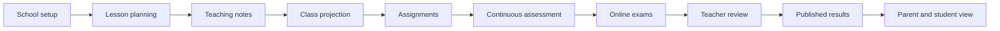
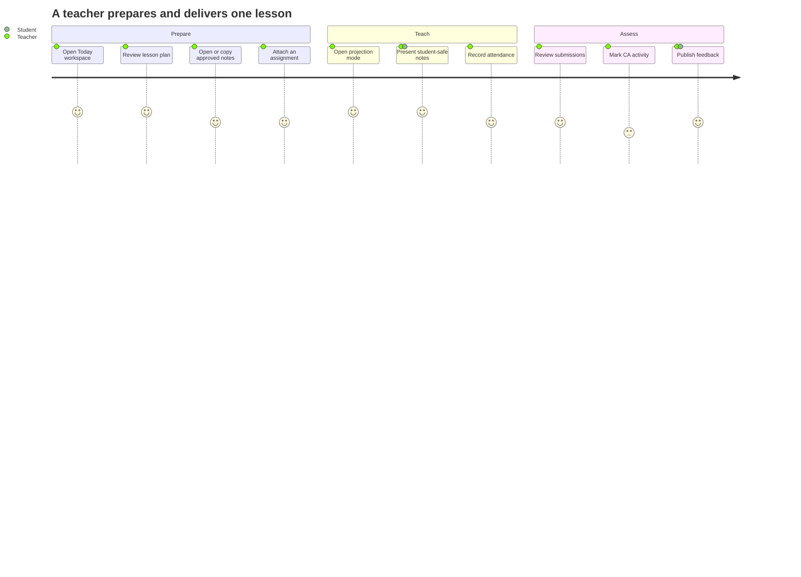
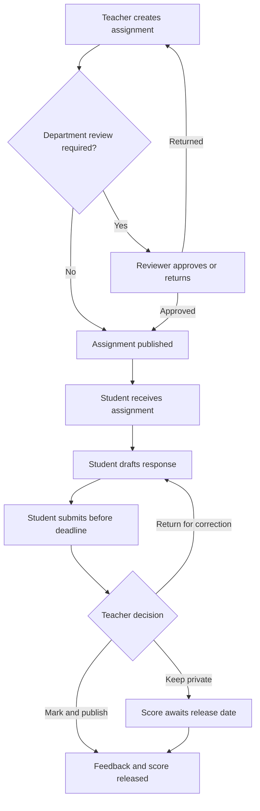
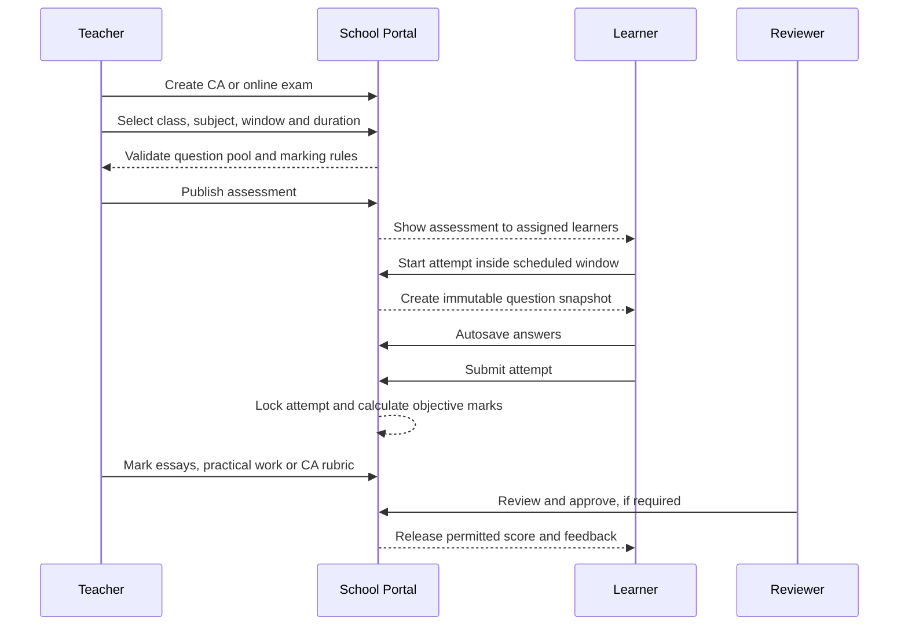
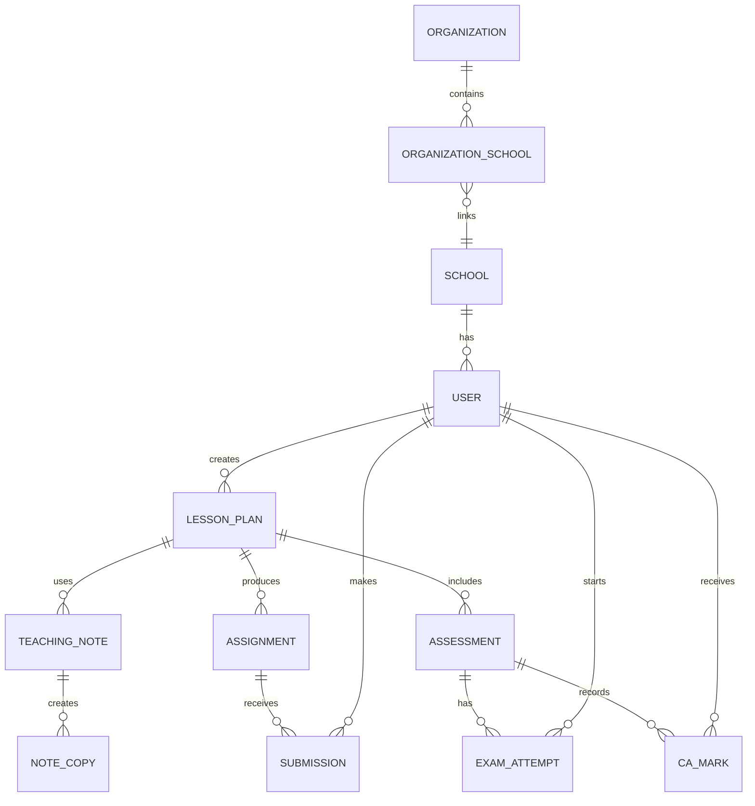

# School Portal Version 2 Plan

## Purpose

Version 2 expands the school portal from a two-tier paid product into a three-tier platform while preserving the current Basic and Premium behavior.

The third plan is **Enterprise**. It targets school groups, larger institutions and organizations that need stronger administration, integrations and support controls.

Version 2 must be released in stages. The Enterprise option must not appear in production checkout or owner assignment until its backend permissions, migration and tests are complete.

## Version 2 At A Glance

The school portal becomes a connected digital school day:



The important idea is one continuous record. A teacher should not create a
lesson in one place, prepare notes in another tool, collect work through a
messaging app and then type marks into a separate spreadsheet. Version 2 links
the lesson, resources, assignment, CA activity, exam and result together.

## Who Uses Version 2

| User | Main view | Primary actions |
| --- | --- | --- |
| Platform owner | Platform console | Plans, organizations, billing, security and support |
| School administrator | School control center | Staff, classes, terms, approvals, reports and policies |
| Head of department | Academic review center | Review lesson plans, approve resources and moderate marks |
| Teacher | Teaching workspace | Plan lessons, prepare notes, teach, assign work and mark submissions |
| Student | Learning workspace | Read notes, join assignments, sit exams and review released results |
| Parent | Family dashboard | Monitor linked children, deadlines, feedback and released results |

No role should see a generic wall of features. Each user lands on the work they
are responsible for today.

## Main Navigation Map

```text
School Portal
|
|-- Today
|   |-- Today's classes
|   |-- Pending submissions
|   |-- Marking queue
|   `-- Upcoming exams
|
|-- Teaching
|   |-- Lesson plans
|   |-- Notes and resources
|   |-- Assignments
|   |-- Continuous assessment
|   |-- Online exams
|   `-- Projection mode
|
|-- Learning
|   |-- My subjects
|   |-- Notes and resources
|   |-- Assignments
|   |-- Exams
|   `-- Results and feedback
|
|-- School administration
|   |-- People and classes
|   |-- Academic calendar
|   |-- Approvals and publication
|   |-- Reports and exports
|   `-- Subscription and settings
|
`-- Organization administration [Enterprise]
	|-- Schools
	|-- Group reports
	|-- Organization users
	`-- Integrations and security
```

The navigation is role-aware, but every item is also protected by backend
permissions and school/organization scope.

## A Teacher's Day



The teacher can copy last term's note as a starting point, but the copied note
becomes a new version. Editing it cannot alter the historical lesson or the
original author's material.

## Student Assignment Journey



The server records every submission timestamp. A changed browser clock, edited
request body or repeated request cannot move a submission back before the
deadline.

## Exam And CA Journey



An attempt is tied to the learner, school, class, subject, assessment version
and server deadline. Editing the question bank later cannot rewrite a completed
attempt.

## Projection Mode

Projection mode is a separate read-only presentation surface, not the normal
teacher editor:

```text
Teacher selects approved lesson
		|
		v
Projection screen
		|
		|-- Large lesson title
		|-- Current objective
		|-- Student-safe note content
		|-- Images, diagrams or links
		|-- Next/previous section controls
		`-- No answer keys, private notes, marks or student records
```

It should work on a laptop connected to a projector, a classroom display or a
large mobile device. The teacher keeps private controls in a separate browser
window or device.

## Version 2 Data Picture



Every learning object carries its school scope. Organization-level objects may
aggregate schools, but they must never remove the school boundary from the
underlying records.

## Plan Catalog

| Plan | Billing | Intended customer |
| --- | --- | --- |
| Setup | Free | School evaluating or preparing the portal |
| Basic | NGN 1,200 per active student per term | Core school operations |
| Premium | NGN 2,000 per active student per term | Schools using exams, analytics and automation |
| Enterprise | Initial proposal: NGN 3,000 per active student per term, subject to owner approval | School groups and larger institutions |

The existing 10% discount remains applicable to schools with 100 or more active students unless the platform owner changes the commercial policy.

All totals must be calculated server-side from the active student count. The frontend may display totals, but it must never determine or authorize the payable amount.

Examples for the proposed Enterprise price:

```text
5 active students:    NGN 15,000 per term
100 active students:  NGN 270,000 per term after 10% discount
```

The Enterprise price is a proposal, not a production change. It must be configured through the existing owner payment controls after commercial approval.

## Feature Matrix

| Capability | Setup | Basic | Premium | Enterprise |
| --- | --- | --- | --- | --- |
| School branding and portal layouts | Yes | Yes | Yes | Yes |
| People and academic calendar | Yes | Yes | Yes | Yes |
| Attendance, scores and report cards | - | Yes | Yes | Yes |
| Fees and PDF receipts | - | Yes | Yes | Yes |
| Timetable builder | - | Yes | Yes | Yes |
| Notification tools | - | Yes | Yes | Yes |
| CBT and DOCX question import | - | - | Yes | Yes |
| Advanced analytics | - | - | Yes | Yes |
| Bulk imports and promotion | - | - | Yes | Yes |
| Result scratch cards | - | - | Yes | Yes |
| Lesson plans and teaching notes | - | - | Yes | Yes |
| Digital lesson resources and note copying | - | - | Yes | Yes |
| Online assignments and submissions | - | - | Yes | Yes |
| Online examinations | - | - | Yes | Yes |
| CA authoring, marking and projections | - | - | Yes | Yes |
| Classroom projection/presentation mode | - | - | Yes | Yes |
| Multi-school/group administration | - | - | - | Planned |
| Organization-wide reporting | - | - | - | Planned |
| API and webhook integrations | - | - | - | Planned |
| SSO and domain restrictions | - | - | - | Planned |
| Priority support and onboarding | - | - | - | Commercial |

Enterprise must not be marketed as including multi-school administration, SSO or integrations until those capabilities exist and have been tested.

## Version 2 Technical Scope

### 1. Plan catalog and data model

- Add `enterprise` to the canonical plan catalog.
- Replace duplicated plan lists with one shared catalog used by models, migrations, APIs and frontend metadata.
- Add a stable plan display name, feature list, billing unit and versioned pricing metadata.
- Keep existing schools on their current plan during migration.
- Add a migration that creates or updates the Enterprise `SubscriptionOffer` without changing Basic or Premium prices.
- Keep historical `PaymentOrder` amounts immutable after checkout initialization.

### 2. Authorization

- Gate every Enterprise-only route in the backend middleware and view permissions.
- Do not rely on hidden navigation or frontend plan checks.
- Add organization-level permissions separately from school-level roles.
- Require platform-owner approval before enabling Enterprise features for a school.
- Ensure suspended, rejected and expired schools cannot regain access by changing plan data alone.

### 3. Organization support

The current model is one school per tenant. Enterprise group administration requires a new ownership layer rather than treating several schools as one school.

Proposed entities:

- `Organization`: the billing and ownership boundary.
- `OrganizationSchool`: membership linking an organization to one or more schools.
- `OrganizationUserRole`: scoped roles such as organization owner, finance manager and reporting reader.
- `OrganizationDomain`: verified domains for optional SSO and login restrictions.

Every organization endpoint must enforce both organization membership and school scope.

### 4. Billing and payments

- Continue charging from the backend-calculated active student count.
- Keep Paystack reference, amount, currency, mode and customer verification checks.
- Add an auditable Enterprise approval state before checkout is enabled.
- Support a quote or negotiated-price workflow only through a server-side owner action.
- Never accept plan, amount or discount values from the browser as authoritative.
- Add reconciliation handling for pending, review, failed and refunded transactions.

### 5. Enterprise reporting

- Add organization-level reports that aggregate only schools belonging to the requesting organization.
- Preserve each school’s historical class, enrollment, fee and result ownership.
- Define whether reports use current or historical enrollment before implementation.
- Add export authorization, audit logging and no-store headers for sensitive reports.

### 6. Integrations and SSO

Implement after the core Enterprise plan is stable:

- API keys scoped to an organization and revocable by an owner.
- Webhook signing secrets with rotation and replay protection.
- Per-key rate limits and audit events.
- SAML or OIDC SSO with verified domains.
- Mandatory MFA for organization owners.

Do not store provider secrets, API keys or SSO credentials in the repository or frontend bundle.

### 7. Digital teaching and learning

Version 2 will provide a complete digital classroom workflow for teachers,
students and school administrators.

#### Lesson plans

- Teachers create lesson plans by subject, class, term, week and lesson period.
- A lesson plan supports objectives, resources, activities, assessment criteria,
	homework and teacher notes.
- Teachers can save drafts, submit plans for review and mark lessons as taught.
- Heads of department or school administrators can review, return and approve
	plans without editing the teacher's original version.
- Historical plans remain tied to the original class, subject and session.

#### Notes and resource library

- Teachers create structured digital notes with headings, text, images, links,
	attachments and downloadable resources.
- Notes can be copied into a new lesson or class only by an authorized teacher.
- Copying creates a new record and never changes the original note.
- Teachers can share resources with selected classes, subjects or schools in
	their organization.
- All uploaded files require type, size, malware and authorization checks.

#### Assignments

- Teachers create assignments with instructions, attachments, marks, due dates,
	allowed attempts and class/subject scope.
- Students submit text, documents or images before the deadline.
- Teachers can return work for resubmission, add feedback and publish marks.
- Late submissions are timestamped and handled according to the assignment
	policy; the browser cannot change the server timestamp.
- Parents may see assignment status for linked children but cannot submit or
	edit student work.

#### Online exams and continuous assessment

- Teachers create controlled online exams and CA activities from approved
	question banks or manually authored questions.
- CA writing supports objective questions, short answers, essays, practical
	work and teacher-entered marks with rubrics.
- Exams enforce class assignment, publication state, start/end time, duration,
	attempt limits and server-side submission deadlines.
- Question, option and marking snapshots are stored per attempt so later edits
	cannot change an existing result.
- Autosave, resume, submission and final marking are idempotent and auditable.
- Results remain hidden until the configured release or teacher approval state.

#### Projection teaching mode

- Teachers can open a classroom projection view for an approved lesson or note.
- Projection mode uses large readable text, high contrast, keyboard navigation
	and optional student-safe resource filtering.
- Private teacher notes, answer keys, unpublished marks and student data are
	excluded from projection responses by the backend.
- A projection session is read-only and cannot modify teaching content.

#### Digital records

- Lesson plans, notes, assignments, submissions, CA marks and exam attempts
	receive immutable audit events for creation, publication, copying, grading,
	return and deletion/archive actions.
- Archive rather than hard-delete records that are referenced by marks,
	submissions or reports.
- Exports are permission-checked, scoped to the school or organization and
	delivered with no-store headers.

## Release Phases

### Phase 2.0: Catalog foundation

- Add the Enterprise catalog entry behind a feature flag.
- Add migration and API contract updates.
- Add the Enterprise offer in staging only.
- Update frontend plan rendering to use API catalog metadata rather than hard-coded plan names.
- Test Basic, Premium and Enterprise pricing for 0, 1, 99, 100 and large student counts.

### Phase 2.1: Enterprise controls

- Add owner approval and plan activation workflow.
- Add Enterprise-specific permission tests.
- Add billing audit events and immutable order tests.
- Verify downgrade behavior does not delete records or silently remove historical access.

### Phase 2.2: Digital classroom foundation

- Add lesson-plan, teaching-note and resource-library models.
- Add teacher draft, review, approval and taught-status workflows.
- Add safe note copying that creates independent versioned records.
- Add assignment creation, student submission, teacher feedback and resubmission.
- Add CA authoring with rubrics, marking and controlled result release.
- Add projection mode with a backend-safe student-facing payload.

### Phase 2.3: Online assessment

- Extend the existing CBT workflow for scheduled online examinations and CA work.
- Enforce class assignment, exam windows, duration, attempts and server-side deadlines.
- Snapshot questions and marking data for every attempt.
- Add autosave, resume, final submission and audit-event coverage.
- Add teacher and administrator review queues before result publication.

### Phase 2.4: Organization administration

- Implement Organization and OrganizationSchool models.
- Add scoped organization roles.
- Add organization dashboard and cross-school reporting.
- Run tenant-isolation tests for every organization endpoint.

### Phase 2.5: Integrations

- Add scoped API keys and signed webhooks.
- Add provider documentation and key rotation procedures.
- Add SSO only after domain verification and MFA recovery workflows are complete.

### Phase 2.6: Commercial launch

- Approve Enterprise price and support terms.
- Run staging with synthetic multi-school data.
- Perform backup and restore drills including MFA and provider configuration.
- Run the full backend security audit and frontend production build.
- Enable Enterprise for selected pilot organizations only.

## Required Tests Before Enterprise Launch

- Existing Basic and Premium schools retain identical access.
- Setup and Basic cannot call Premium or Enterprise APIs.
- Premium cannot call Enterprise APIs.
- Enterprise access requires an approved active school and the correct organization scope.
- A school administrator cannot read another school’s organization data.
- A platform viewer cannot modify Enterprise pricing or activation.
- Changing the browser-submitted plan or amount cannot reduce the server-calculated charge.
- Duplicate webhook delivery settles an order once.
- Failed, pending and review payments do not activate Enterprise.
- Password changes and account deactivation revoke old sessions.
- Teachers can only create or view lesson plans, notes, assignments and CA work for assigned classes and subjects.
- Copying a note creates an independent record and cannot expose private teacher notes or answer keys.
- Students can submit only their own assignment and exam work, within the server-enforced window.
- Late assignment and exam submissions cannot be made valid by changing the browser clock.
- Projection responses exclude answer keys, private notes, unpublished marks and unrelated student data.
- Published marks and submitted work are archived or corrected through an audited workflow, not destructive deletion.
- Online exam autosave and final submission are idempotent under retries and concurrent requests.
- All sensitive Enterprise exports use authorization checks and `Cache-Control: no-store`.
- Mobile layouts work at approximately 390px width.
- Production configuration checks fail closed when any required secret, host, HTTPS origin or TLS Redis value is missing.

## Rollback Plan

- Keep Enterprise behind a server-side feature flag until pilot approval.
- Disable new Enterprise offers without deleting existing schools or payment history.
- Preserve all historical orders and audit events.
- If an Enterprise migration fails, restore the database backup before retrying; never edit production plan rows manually without an audit event.
- Revert frontend catalog display only after the backend has stopped accepting new Enterprise checkouts.

## Definition of Done

Version 2 is ready for controlled commercial rollout when:

1. Enterprise is represented in one canonical backend catalog.
2. Pricing and discounts are calculated and verified server-side.
3. Organization and school boundaries have automated isolation tests.
4. Enterprise permissions are enforced by the API, not only the UI.
5. Paystack, webhook, refund and reconciliation behavior is tested in staging.
6. The full backend suite, readiness audit and frontend production build pass.
7. Backup, restore, MFA recovery and secret rotation procedures are documented.
8. A real pilot organization has completed onboarding, billing and reporting smoke tests.
